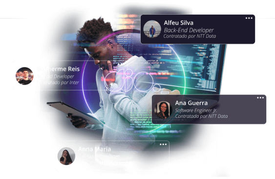

# 🚀 Clone da Página da DIO

Este projeto é um **clone do site da Digital Innovation One (DIO)** desenvolvido por mim como exercício para dar meus **primeiros passos em React**.



---

## 🛠️ Tecnologias Utilizadas

- **React**
- **React Router**
- **Styled-Components**
- **React-Icons**
- **JavaScript (ES6+)**

---

## 🎯 Objetivos

✅ Praticar os conceitos básicos de React:  
- Componentização  
- Passagem de props  
- Criação de formulários  
- Estilização com Styled-Components  
- Implementação de ícones com React-Icons  
- Estruturação e organização de um projeto em React  

---


## 🔧 Como Rodar Localmente

1️⃣ Clone o repositório:
```bash
git clone https://github.com/seu-usuario/nome-do-repositorio.git
